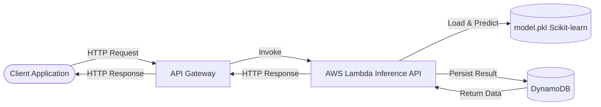
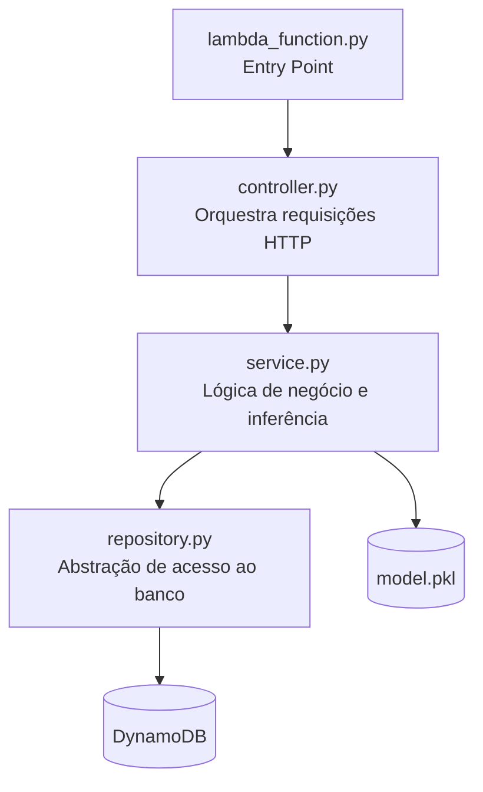
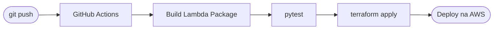

# Desafio Técnico — Engenharia de Machine Learning Sênior

Solução para o desafio técnico de Engenharia de Machine Learning Sênior, implementando uma **API Serverless de inferência de Machine Learning** com **AWS Lambda, API Gateway, DynamoDB e Terraform**, seguindo boas práticas de **Clean Architecture, SOLID e MLOps**.

---

## Arquitetura da Solução



**Fluxo da aplicação:**

1. O cliente envia uma requisição HTTP para a API.
2. O **API Gateway** encaminha a requisição para a **AWS Lambda**.
3. A Lambda carrega o modelo e executa a inferência.
4. O resultado é persistido no **DynamoDB**.
5. A resposta é retornada ao cliente.

---

## Estrutura do Repositório

```
.
├── .github/
│   └── workflows/
│       └── deploy.yml
├── infra/
│   └── main.tf
├── docs/
│   └── openapi.yaml
├── src/
│   ├── lambda_function.py
│   ├── controller.py
│   ├── service.py
│   ├── repository.py
│   ├── schemas.py
│   ├── requirements.txt
│   └── modelo/
│       ├── treinamento.ipynb
│       └── model.pkl
├── tests/
│   └── test_api.py
└── README.md
```

---

## Princípios de Arquitetura

### Clean Architecture

A aplicação é organizada em camadas com responsabilidades bem definidas:



| Camada       | Arquivo               | Responsabilidade                        |
|--------------|-----------------------|-----------------------------------------|
| Entry Point  | `lambda_function.py`  | Handler da Lambda, roteamento inicial   |
| Controller   | `controller.py`       | Orquestra requisições HTTP              |
| Service      | `service.py`          | Executa lógica de negócio e inferência  |
| Repository   | `repository.py`       | Abstrai acesso ao banco de dados        |
| Database     | DynamoDB              | Persistência de dados                   |

---

## Infraestrutura como Código (Terraform)

A infraestrutura é provisionada automaticamente via **Terraform** (`infra/main.tf`).

**Recursos provisionados:**

| Recurso Terraform            | Descrição                         |
|------------------------------|-----------------------------------|
| `aws_lambda_function`        | Função de inferência              |
| `aws_api_gateway_rest_api`   | Gateway de entrada HTTP           |
| `aws_dynamodb_table`         | Tabela de resultados (On-Demand)  |
| `aws_iam_role`               | Permissões de execução            |

> O DynamoDB utiliza **modo On-Demand** para eliminar o provisionamento manual de capacidade.

---

## Especificação da API

Documentação completa em `docs/openapi.yaml` (OpenAPI 3.0).

### `POST /sobreviventes` — Criar escoragem

**Request:**
```json
{
  "caracteristicas": [1, 0, 22, 1, 0, 7.25]
}
```

**Response:**
```json
{
  "id": "uuid",
  "probabilidade_sobrevivencia": 0.87
}
```

### `GET /sobreviventes` — Listar passageiros

### `GET /sobreviventes/{id}` — Buscar passageiro por ID

### `DELETE /sobreviventes/{id}` — Remover passageiro

---

## Modelo de Machine Learning

O modelo foi treinado no notebook `treinamento.ipynb` com **Scikit-learn** e serializado via **Pickle**.

```
src/modelo/model.pkl
```

O modelo é carregado pela Lambda no momento da execução para realizar inferência sobre as características do passageiro.

---

## Pipeline CI/CD



Pipeline configurado em `.github/workflows/deploy.yml`.

---

## Testes

```bash
# Instalar dependências
pip install -r src/requirements.txt

# Executar testes
pytest tests/
```

---

## Deploy da Infraestrutura

```bash
# Inicializar Terraform
terraform init

# Revisar plano de execução
terraform plan

# Aplicar infraestrutura
terraform apply
```

---

## Tecnologias Utilizadas

| Categoria        | Tecnologia                          |
|------------------|-------------------------------------|
| Linguagem        | Python                              |
| ML Framework     | Scikit-learn                        |
| Compute          | AWS Lambda                          |
| API              | AWS API Gateway                     |
| Banco de Dados   | AWS DynamoDB                        |
| IaC              | Terraform                           |
| CI/CD            | GitHub Actions                      |
| Documentação API | OpenAPI 3.0                         |

---

## Considerações de Engenharia

A solução foi projetada priorizando:

- **Serverless** — sem gerenciamento de servidores
- **Escalabilidade automática** — Lambda e DynamoDB On-Demand
- **Baixo custo operacional** — pagamento por uso
- **Reprodutibilidade** — infraestrutura 100% em código
- **Separação de responsabilidades** — Clean Architecture

### Evoluções Previstas

- Observabilidade com **CloudWatch** e alertas
- Monitoramento de drift do modelo
- Versionamento de modelos com **S3 + MLflow**
- Pipeline completo de **MLOps** com retreino automático
