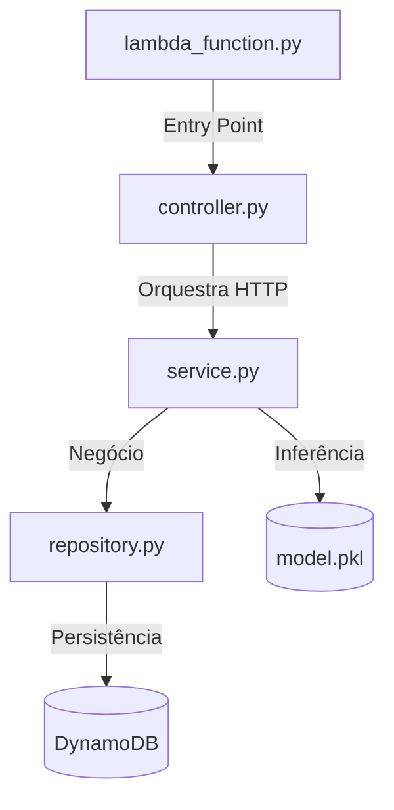
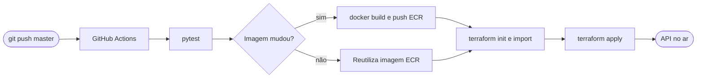

# Desafio Técnico — Engenharia de Machine Learning Sênior

Solução para o desafio técnico de Engenharia de Machine Learning Sênior, implementando uma **API Serverless de inferência de Machine Learning** com **AWS Lambda, API Gateway, DynamoDB e Terraform**, seguindo boas práticas de **Clean Architecture, SOLID e MLOps**.

---

## Arquitetura da Solução


**Fluxo da aplicação:**

1. O cliente envia uma requisição HTTP para o API Gateway.
2. O API Gateway roteia a chamada para a função AWS Lambda.
3. A Lambda executa a partir de uma imagem Docker com o modelo e as dependências embutidas.
4. O resultado é persistido no DynamoDB.
5. A resposta é retornada ao cliente com o ID e a probabilidade de sobrevivência.

> A Lambda utiliza **Container Image** (via Amazon ECR) para contornar o limite de 250MB das abordagens de pacote ZIP e Lambda Layer. O limite de imagens é de 10GB, suficiente para acomodar `scikit-learn`, `scipy`, `numpy` e `pandas`.

---

## Estrutura do Repositório

```
.
├── .github/
│   └── workflows/
│       └── deploy.yml
├── infra/
│   └── main.tf
├── docs/
│   └── openapi.yaml
├── src/
│   ├── lambda_function.py
│   ├── controller.py
│   ├── service.py
│   ├── repository.py
│   ├── schemas.py
│   ├── requirements.txt
│   └── modelo/
│       └── model.pkl
├── tests/
│   └── test_api.py
├── Dockerfile
├── treinamento.ipynb
└── README.md
```

---

## Princípios de Arquitetura

### Clean Architecture



| Camada      | Arquivo              | Responsabilidade                      |
|-------------|----------------------|---------------------------------------|
| Entry Point | `lambda_function.py` | Handler da Lambda, roteamento inicial |
| Controller  | `controller.py`      | Orquestra requisições HTTP            |
| Service     | `service.py`         | Executa inferência com o modelo pkl   |
| Repository  | `repository.py`      | Abstrai acesso ao DynamoDB            |
| Database    | DynamoDB             | Persistência de dados                 |

---

## Modelo de Machine Learning

O modelo foi treinado no notebook `treinamento.ipynb` usando o dataset público do Titanic.

**Algoritmo:** `RandomForestClassifier` (Scikit-learn)
- `n_estimators=100`, `max_depth=5`, `oob_score=True`, `random_state=42`
- ROC-AUC no conjunto de teste: **0.80**

**Features de entrada (ordem obrigatória no array):**

| Posição | Feature      | Descrição               | Valores                         |
|---------|--------------|-------------------------|---------------------------------|
| 0       | `Age`        | Idade do passageiro     | número decimal (ex: `22.0`)     |
| 1       | `Parch`      | Pais/filhos a bordo     | inteiro (ex: `0`)               |
| 2       | `SibSp`      | Irmãos/cônjuge a bordo  | inteiro (ex: `1`)               |
| 3       | `Fare`       | Valor da passagem       | número decimal (ex: `7.25`)     |
| 4       | `Pclass`     | Classe da cabine        | `1`, `2` ou `3`                 |
| 5       | `Sex_male`   | Sexo                    | `1` = masculino, `0` = feminino |
| 6       | `Embarked_Q` | Embarcou em Queenstown  | `1` = sim, `0` = não            |
| 7       | `Embarked_S` | Embarcou em Southampton | `1` = sim, `0` = não            |

> Se o passageiro embarcou em Cherbourg, `Embarked_Q = 0` e `Embarked_S = 0`.

---

## Especificação da API

Documentação completa em `docs/openapi.yaml` (OpenAPI 3.0).

**Base URL:**
```
https://{id}.execute-api.us-east-1.amazonaws.com/v1
```

### `POST /sobreviventes` — Criar escoragem

**Request:**
```json
{
  "caracteristicas": [22.0, 0, 1, 7.25, 3, 1, 0, 1]
}
```

**Response `201`:**
```json
{
  "id": "uuid-gerado",
  "probabilidade_sobrevivencia": 0.12
}
```

**Response `400`:**
```json
{
  "erro": "Payload inválido: O campo 'caracteristicas' deve ser uma lista válida."
}
```

### `GET /sobreviventes` — Listar todos os passageiros

### `GET /sobreviventes/{id}` — Buscar passageiro por ID

### `DELETE /sobreviventes/{id}` — Remover passageiro

---

## Infraestrutura como Código (Terraform)

A infraestrutura é provisionada automaticamente via **Terraform** (`infra/main.tf`).

| Recurso Terraform                | Descrição                                      |
|----------------------------------|------------------------------------------------|
| `aws_ecr_repository`             | Repositório de imagens Docker da Lambda        |
| `aws_dynamodb_table`             | Tabela On-Demand — sem provisionamento manual  |
| `aws_lambda_function`            | Função via container image (package_type=Image)|
| `aws_api_gateway_rest_api`       | Gateway provisionado via contrato OpenAPI      |
| `aws_iam_role`                   | Execution role da Lambda                       |
| `aws_iam_policy`                 | Política de privilégio mínimo                  |
| `aws_iam_role_policy_attachment` | Vincula a política à role                      |
| `aws_lambda_permission`          | Autoriza o API Gateway invocar a Lambda        |
| `aws_api_gateway_deployment`     | Publicação do estado atual da API              |
| `aws_api_gateway_stage`          | Stage `v1` da API                              |

---

## Pipeline CI/CD



**Lógica de cache da imagem:**

O pipeline computa o MD5 combinado de `requirements.txt` e `Dockerfile`, e compara com a tag `build-hash` armazenada no repositório ECR. Se houver diferença, a imagem é reconstruída e publicada. Caso contrário, a imagem existente é reutilizada, economizando tempo de build.

---

## Testes

```bash
pip install -r src/requirements.txt
pip install pytest
PYTHONPATH=src pytest tests/test_api.py
```

Os testes utilizam `MagicMock` para simular o modelo e o DynamoDB — nenhuma chamada real à AWS é feita durante a execução da suite.

---

## Deploy

```bash
cd infra
terraform init
terraform import aws_ecr_repository.titanic_repo titanic-inference-api || true
terraform import aws_dynamodb_table.titanic_table sobreviventes_titanic || true
terraform import aws_iam_role.lambda_exec_role lambda_mlops_exec_role || true
terraform import aws_iam_policy.lambda_policy arn:aws:iam::{account_id}:policy/lambda_mlops_policy || true
terraform import aws_lambda_function.titanic_ml titanic_inference_api || true
terraform apply -auto-approve
```

---

## Tecnologias Utilizadas

| Categoria        | Tecnologia      |
|------------------|-----------------|
| Linguagem        | Python 3.9      |
| ML Framework     | Scikit-learn    |
| Compute          | AWS Lambda      |
| Container        | Docker / ECR    |
| API              | AWS API Gateway |
| Banco de Dados   | AWS DynamoDB    |
| IaC              | Terraform       |
| CI/CD            | GitHub Actions  |
| Documentação API | OpenAPI 3.0     |

---

## Autora

**Sophie Pyxis de Paula**
GitHub: [@sophie-pyxis](https://github.com/sophie-pyxis)
